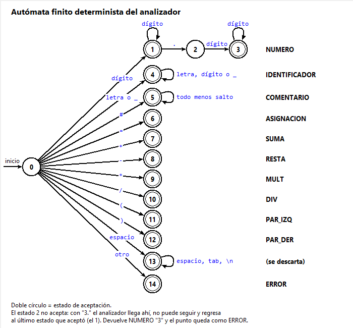

# Analizador léxico con FLEX

Analizador léxico para una calculadora con variables. El analizador se genera con FLEX y se
compila con gcc a `analizador.exe`. La ventana está hecha en Python con Tkinter.

Para usarlo basta con abrir `AnalizadorLexico.exe`, escribir el código y presionar
**Analizar** (o F5). Para volver a compilar el analizador está `compilar.bat`, que necesita
flex y gcc.

## El lenguaje

Una calculadora con variables: se asignan valores a variables y se escriben operaciones
aritméticas con paréntesis.

```
# precio con descuento
precio = 150.50
descuento = 0.15
total = precio - (precio * descuento)
```

**Alfabeto:** letras `a-z` y `A-Z`, dígitos `0-9`, guion bajo `_`, los símbolos
`= + - * / ( ) . #`, espacio, tabulador y salto de línea. Cualquier otro carácter es un error
léxico.

### Tokens

```
digito    [0-9]
letra     [a-zA-Z_]
```

| Token | Patrón | Ejemplos |
|---|---|---|
| NUMERO | `{digito}+("."{digito}+)?` | `42`, `3.14` |
| IDENTIFICADOR | `{letra}({letra}\|{digito})*` | `x`, `precio_final` |
| ASIGNACION | `=` | |
| SUMA | `+` | |
| RESTA | `-` | |
| MULT | `*` | |
| DIV | `/` | |
| PAR_IZQ | `(` | |
| PAR_DER | `)` | |
| COMENTARIO | `"#".*` | `# un comentario` |
| ERROR | cualquier otro carácter | `@`, `$`, `ñ` |

Los espacios, tabuladores y saltos de línea solo separan los tokens y no se devuelven.

### Reglas

- Un decimal lleva dígitos a los dos lados del punto: `3.14` es NUMERO, pero `3.` da NUMERO
  `3` y ERROR `.`, y `.5` da ERROR `.` y NUMERO `5`.
- Un identificador empieza con letra o `_`, nunca con dígito: `2x` son NUMERO `2` e
  IDENTIFICADOR `x`.
- El comentario va desde `#` hasta el final de la línea.
- Si varias reglas coinciden, gana el lexema más largo; si miden lo mismo, gana la regla
  escrita primero.

## El autómata



Desde el estado inicial 0, el primer carácter decide el token. Los estados con doble círculo
son de aceptación. El estado 2 no acepta: con `3.` el analizador llega ahí, no puede seguir,
y regresa al último estado que aceptó, el 1. Devuelve NUMERO `3` y el punto queda como ERROR.
